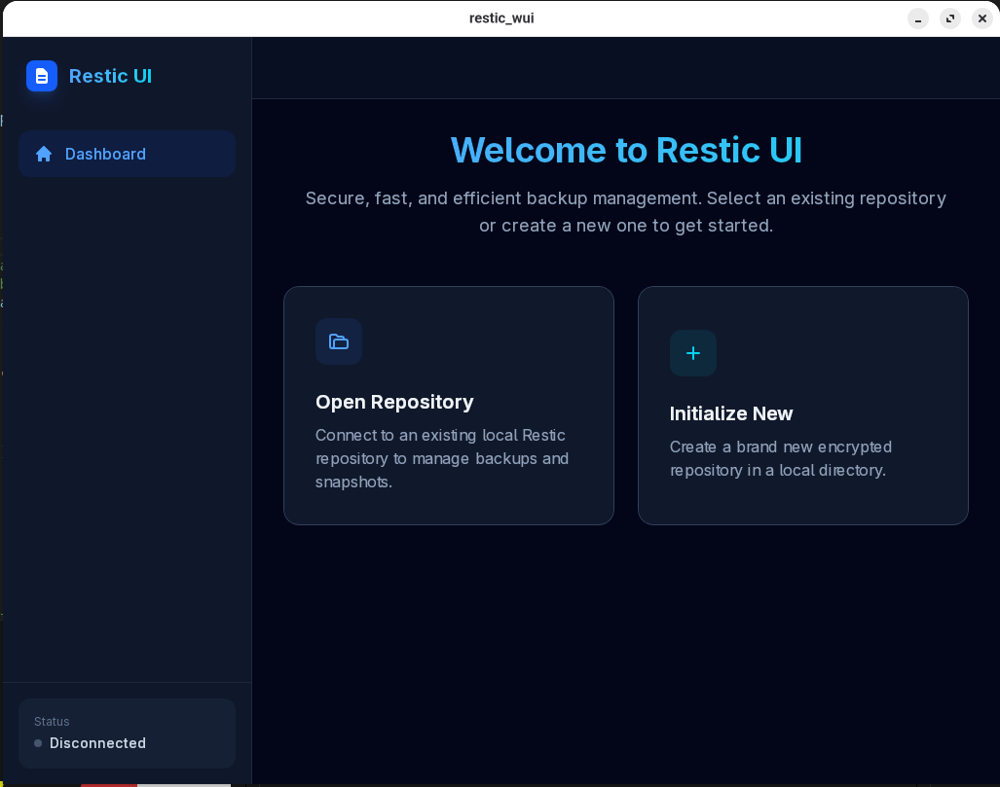
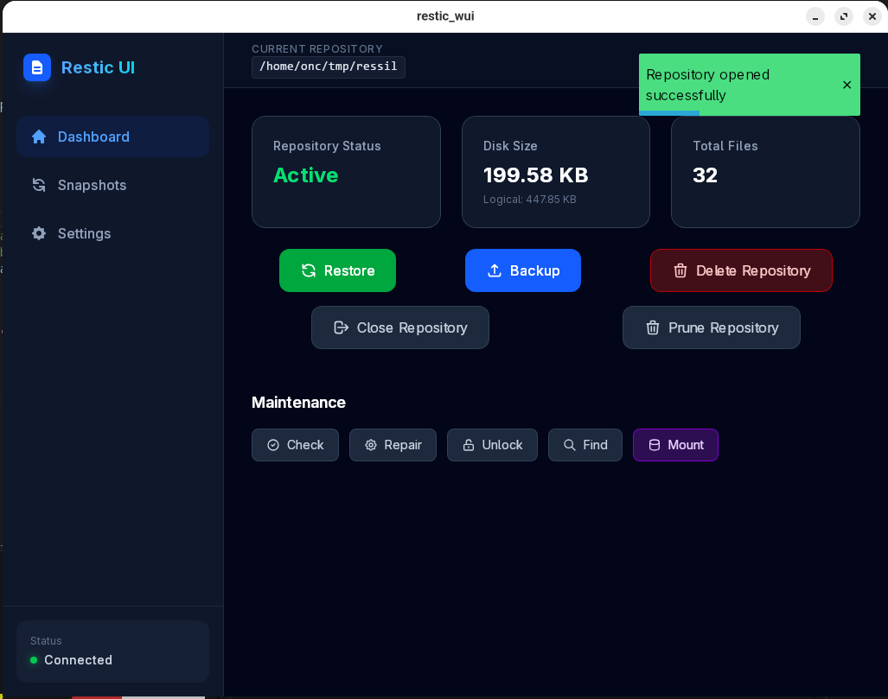
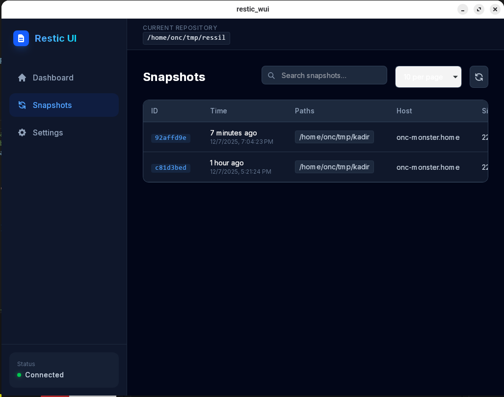
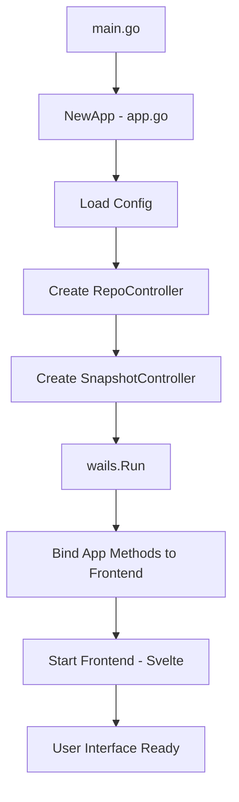
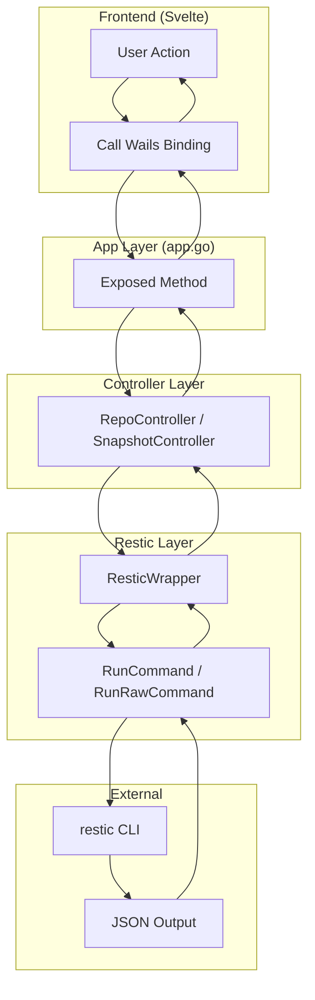
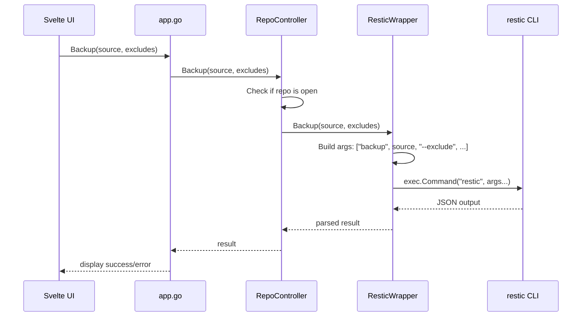
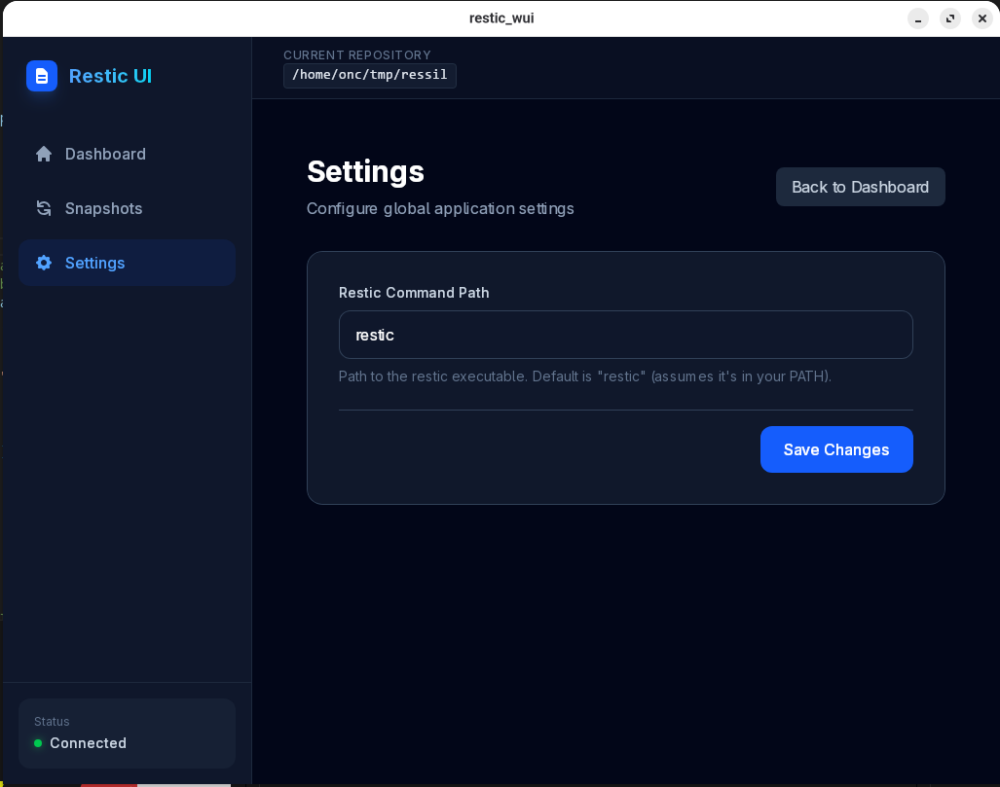

# Restic WUI

A modern desktop application providing a graphical user interface for [Restic](https://restic.net/) backup tool. Built with [Wails](https://wails.io/) framework, combining a Go backend with a Svelte frontend for a native cross-platform experience.




## Features

- **Repository Management**
  - Initialize new repositories
  - Open existing repositories
  - View repository statistics (size, file count, snapshots)
  - Delete repositories
  - Check repository integrity
  - Repair/rebuild index
  - Unlock stale locks
  - Prune unused data

- **Snapshot Operations**
  - List all snapshots with details
  - Browse snapshot contents
  - Forget (delete) snapshots
  - Restore snapshots to target directory

- **Backup & Restore**
  - Create backups with exclude patterns
  - Restore specific files or entire snapshots
  - Find files across all snapshots

- **Mount Support**
  - Mount repository as filesystem (FUSE)
  - Browse backups in file manager

- **Settings**
  - Configure restic executable path
  - Persistent configuration via INI file



## Technology Stack

### Backend
| Technology | Purpose |
|------------|---------|
| [Go](https://golang.org/) (1.24+) | Backend language |
| [Wails v2](https://wails.io/) | Desktop application framework |
| [gopkg.in/ini.v1](https://github.com/go-ini/ini) | Configuration file handling |

### Frontend
| Technology | Purpose |
|------------|---------|
| [Svelte 5](https://svelte.dev/) | UI framework |
| [SvelteKit](https://kit.svelte.dev/) | Application framework |
| [TailwindCSS 4](https://tailwindcss.com/) | Styling |
| [Vite](https://vitejs.dev/) | Build tool |
| [svelte-toast](https://github.com/zerodevx/svelte-toast) | Toast notifications |
| [svelte-loading-spinners](https://github.com/Schum123/svelte-loading-spinners) | Loading indicators |

### External Dependencies
| Dependency | Purpose |
|------------|---------|
| [Restic](https://restic.net/) | Backup tool (must be installed separately) |
| FUSE | Required for mount functionality |

## Project Structure

```
restic_wui/
├── main.go                    # Application entry point
├── app.go                     # Wails app struct, binds Go methods to frontend
├── settings.go                # Additional settings helpers
├── return_json.go             # JSON response utilities
├── wails.json                 # Wails configuration
├── go.mod                     # Go module definition
│
├── internal/
│   ├── config/
│   │   └── config.go          # INI configuration management
│   │
│   ├── controller/
│   │   ├── repo.go            # Repository operations controller
│   │   └── snapshot.go        # Snapshot operations controller
│   │
│   └── restic/
│       ├── command.go         # ResticWrapper - CLI execution
│       ├── repository.go      # Repository-specific commands
│       ├── snapshot.go        # Snapshot-specific commands
│       └── types.go           # Data structures for restic output
│
├── fileop/
│   ├── file_size.go           # File size utilities
│   └── read_write.go          # File I/O helpers
│
└── frontend/
    ├── package.json           # Node.js dependencies
    ├── svelte.config.ts       # Svelte configuration
    ├── vite.config.ts         # Vite configuration
    │
    └── src/
        ├── routes/
        │   ├── +page.svelte       # Main dashboard
        │   ├── +layout.svelte     # App layout
        │   ├── settings/
        │   │   └── +page.svelte   # Settings page
        │   └── snapshots/
        │       └── +page.svelte   # Snapshots view
        │
        └── lib/
            ├── components/
            │   ├── Header.svelte        # Application header
            │   ├── Sidebar.svelte       # Navigation sidebar
            │   ├── Modal.svelte         # Modal dialog
            │   ├── ToastMessage.svelte  # Toast notifications
            │   ├── RepositoryCrud.svelte # Repository management UI
            │   ├── SnapshotCrud.svelte  # Snapshot management UI
            │   └── FindResults.svelte   # Search results display
            │
            └── wailsjs/               # Auto-generated Wails bindings
```

## Architecture Flow

The application follows a layered architecture where the frontend communicates with the Go backend through Wails bindings, which then executes restic CLI commands.

### Application Startup Flow



### Command Execution Flow



### Layer Responsibilities

| Layer | File(s) | Responsibility |
|-------|---------|----------------|
| **Entry Point** | `main.go` | Initialize Wails, create App, start application |
| **App** | `app.go` | Expose methods to frontend, coordinate controllers |
| **Controller** | `internal/controller/*.go` | Business logic, validation, orchestration |
| **Restic Wrapper** | `internal/restic/*.go` | Execute restic CLI, parse JSON output |
| **Config** | `internal/config/config.go` | Load/save application settings |

### Example: Backup Operation




## Installation

### Prerequisites

1. **Go 1.24+** - [Download](https://golang.org/dl/)
2. **Node.js 18+** - [Download](https://nodejs.org/)
3. **pnpm** - `npm install -g pnpm`
4. **Wails CLI** - `go install github.com/wailsapp/wails/v2/cmd/wails@latest`
5. **Restic** - [Installation Guide](https://restic.readthedocs.io/en/stable/020_installation.html)

### Build from Source

```bash
# Clone the repository
git clone https://github.com/yourusername/restic_wui.git
cd restic_wui

# Install frontend dependencies
cd frontend
pnpm install
cd ..

# Run in development mode
wails dev

# Build for production
wails build
```

The built executable will be in the `build/bin/` directory.

## Usage

### Getting Started

1. **Launch the application**
2. **Initialize a new repository** or **Open an existing one**
   - Select a directory for the repository
   - Enter a password (remember this - it cannot be recovered!)
3. **Create your first backup**
   - Click "Backup" and select source directory
   - Optionally add exclude patterns
4. **View and manage snapshots**
   - Navigate to Snapshots view
   - Browse contents, restore, or delete snapshots

### Settings

Configure the restic executable path in Settings if restic is not in your system PATH.



## Development

### Running in Development Mode

```bash
wails dev
```

This starts the application with hot-reload for frontend changes.

### Project Commands

| Command | Description |
|---------|-------------|
| `wails dev` | Run in development mode with hot-reload |
| `wails build` | Build production executable |
| `wails build -clean` | Clean build |
| `cd frontend && pnpm dev` | Run frontend only (for UI development) |
| `cd frontend && pnpm check` | Run Svelte type checking |

### Adding New Restic Commands

1. Add method to `internal/restic/*.go` (wrapper layer)
2. Add controller method in `internal/controller/*.go`
3. Expose through `app.go`
4. Wails auto-generates TypeScript bindings in `frontend/src/lib/wailsjs/`
5. Use in Svelte components

## Contributing

Contributions are welcome! I would be happy to have you participate in this project.


### Areas for Contribution

- 🐛 Bug fixes
- 🚀 Performance improvements
- 📦 Coding style and best practices
- ✨ New features
- 📖 Documentation improvements
- 🌍 Internationalization
- 🎨 UI/UX enhancements
- 🧪 Test coverage

## License

This project is open source. See the [LICENSE](LICENSE) file for details.

## Acknowledgments

- [Restic](https://restic.net/) - The powerful backup program this UI wraps
- [Wails](https://wails.io/) - For making Go + Web UI desktop apps possible
- [Svelte](https://svelte.dev/) - For the reactive UI framework

---

**Note:** This project requires the `restic` CLI tool to be installed on your system. The GUI is a wrapper that provides a user-friendly interface but all backup operations are performed by restic itself.
